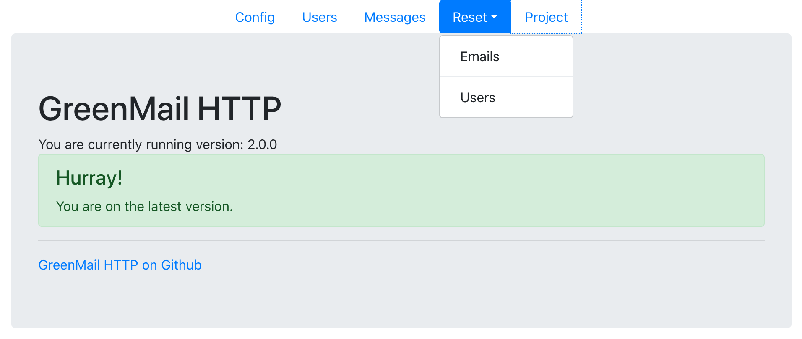
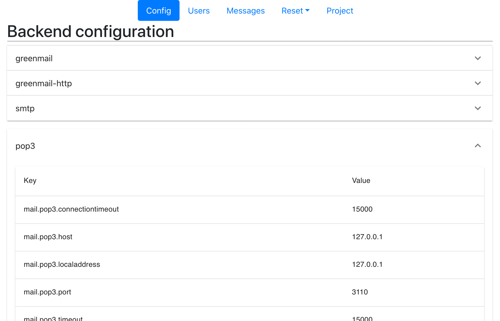
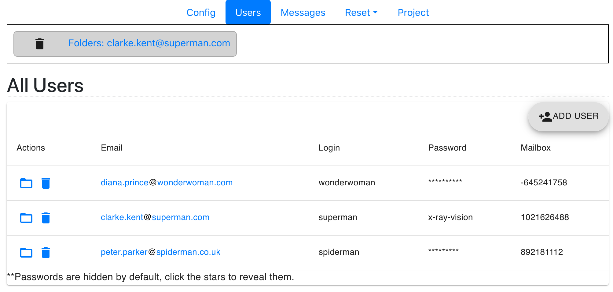
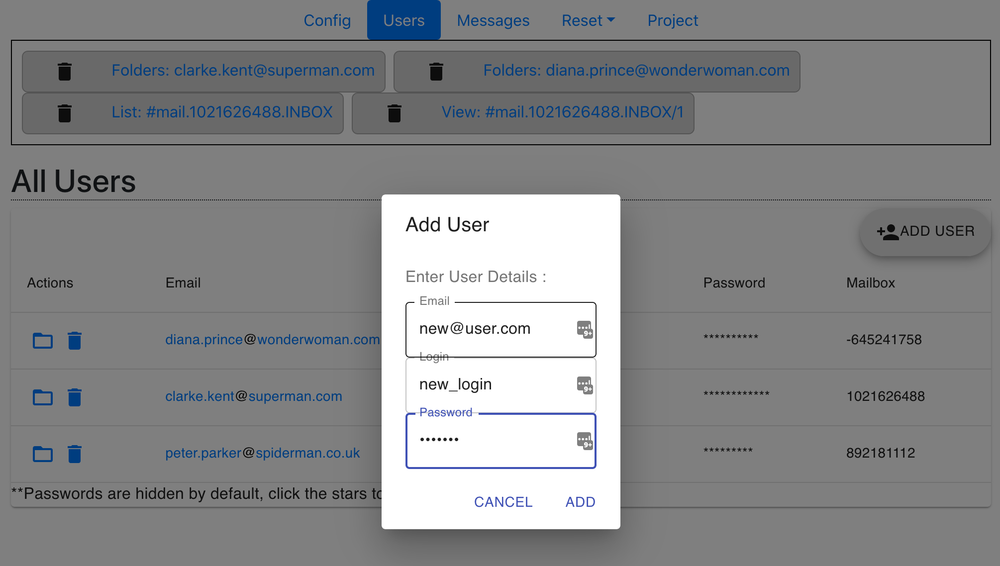
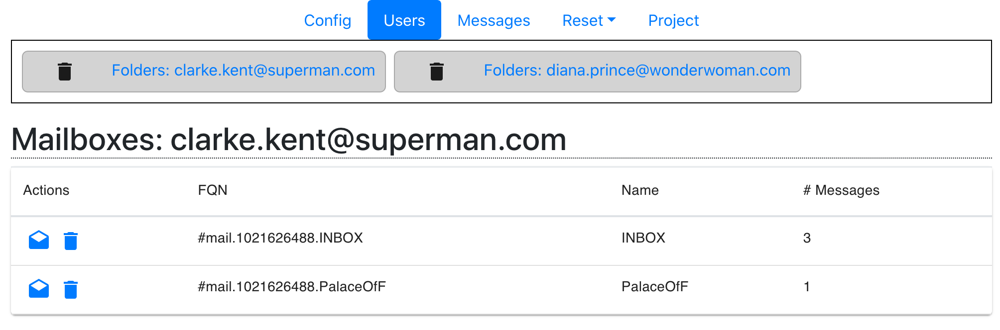
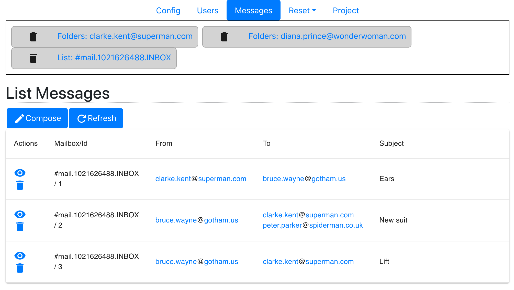
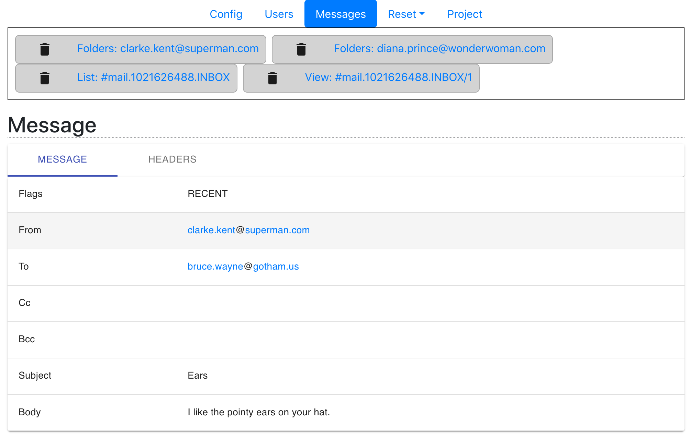
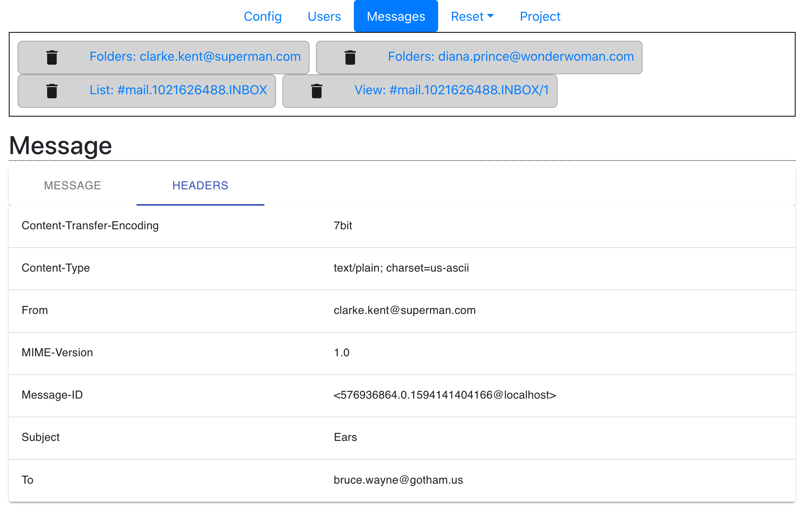
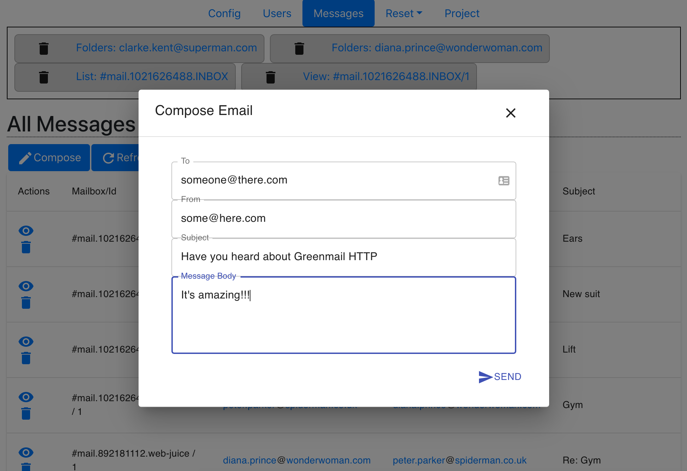
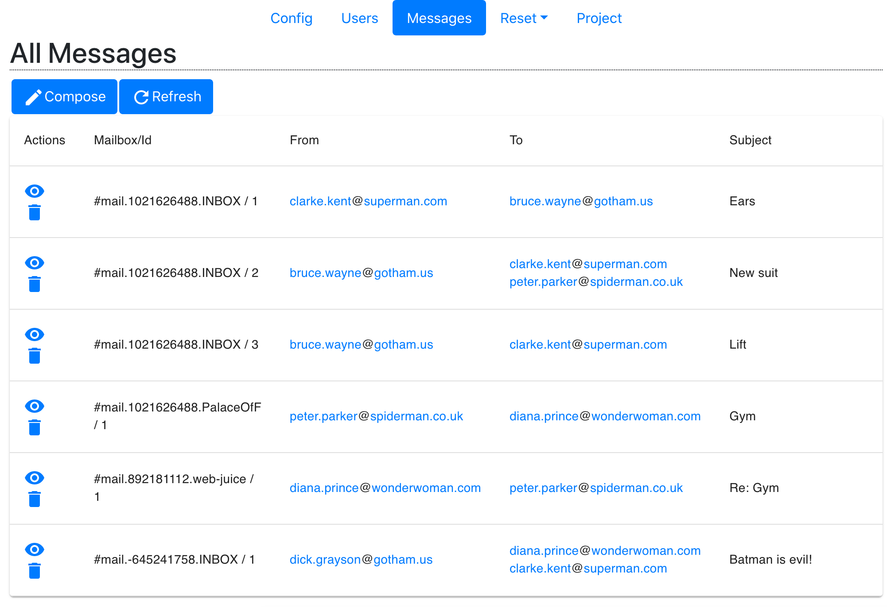

# GreenMail HTTP Frontend
Written in ReactJS, using Material-UI and Axios.

## Run locally
Maven builds this package as part of the main build but if you'd like to develop it then it's easy.

```
yarn install
yarn start
```
A web browser will open automatically showing the front page.
You must have the GreenMail HTTP application running (obviously!).
If you get CORS issues then consider adding [ac_anywhere](../README.md#user-content-run-with-access-control-allow-origin).

## Screenshots
### Project
Checks if you are on the latest version.


### Config
Collapsable configuration


### Users
List users

Add user


### Messages
Clarke Kent's mailbox

Clarke Kent's inbox


### Messages
Message body

Message Headers

Compose and send mail

All messages (without folders)


